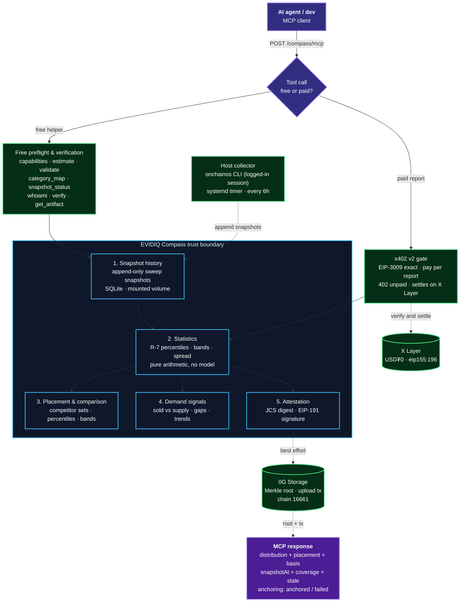
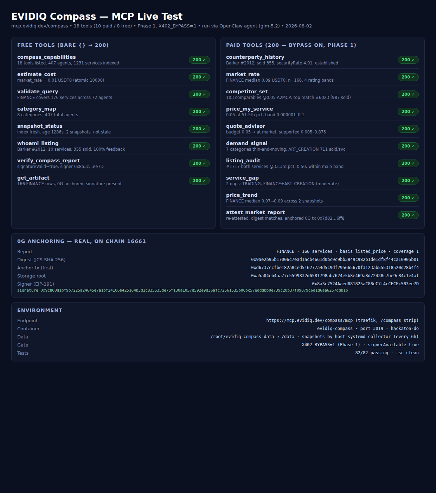

<p align="center">
  
</p>

<p align="center">
  <h1 align="center">EVIDIQ Compass</h1>
</p>

<p align="center"><strong>Pricing and demand intelligence for the OKX.AI agent market</strong></p>

<p align="center">
  Agent-market price discovery for both sides of the deal: what a service should cost,
  where a listing sits in its category, where demand is thin, and a signed, 0G-anchored
  report a seller can cite in a negotiation. Service #18 of the EVIDIQ fleet.
</p>

<p align="center">
  <a href="https://evidiq.dev">evidiq.dev</a> &middot;
  <a href="https://mcp.evidiq.dev/compass/skill.md">Agent Skill</a> &middot;
  <a href="https://github.com/evidiq/evidiq-compass-mcp">Compass MCP</a>
</p>

<p align="center">
  <a href="https://mcp.evidiq.dev/compass/mcp"></a>
  <a href="https://www.oklink.com/xlayer"></a>
  <a href="https://mcp.evidiq.dev/compass/x402"></a>
  <a href="https://web3.okx.com/onchainos/dev-docs/payments/service-seller-sdk"></a>
  <a href="./LICENSE"></a>
</p>

---

**EVIDIQ Compass reads the OKX.AI agent market so agents don't have to guess what to charge.**
It holds a growing snapshot history of the whole marketplace — every agent, every service,
every listed price — and answers placement, distribution, and demand questions from that
history, with every number traceable to a snapshot instead of a model's opinion.

1. **Fresh marketplace index** — a host collector sweeps the OKX.AI agent search API on a
   systemd timer (every 6h), appends append-only snapshots to `/data/snapshots`, and the
   server serves statistics from the latest sweep with freshness and coverage stated.
2. **MCP server** — 18 tools (8 free, 10 paid) that turn that index into decisions:
   `market_rate`, `price_my_service`, `competitor_set`, `quote_advisor`, `demand_signal`,
   `listing_audit`, `service_gap`, `price_trend`, `counterparty_history`,
   `attest_market_report` for money; `compass_capabilities`, `estimate_cost`,
   `validate_query`, `category_map`, `snapshot_status`, `whoami_listing`,
   `verify_compass_report`, `get_artifact` for free.

> **Launch status: Phase 1 — live, gate bypassed, not yet listed.** Deployed at
> `https://mcp.evidiq.dev/compass/mcp` (port 3019) with the x402 gate bypassed so every tool
> can be exercised and its behaviour proven before payment goes live. The market index is
> real: two snapshots, 407 agents, 1,231 services, measured coverage 1.0. One report is
> already attested and 0G-anchored on chain. **Phase 2 (gate on, OKX.AI registration, live
> paid settlement) is planned — the table cells below stay blank until observed.**
>
> **Data path (§5):** the OKX agent-search REST endpoint rejects non-session credentials
> (`code 10008`), so no wallet token can be used headlessly. Compass therefore uses **path B**:
> the fleet's own onchainos CLI session (already logged into OKX.AI) runs the sweeps on the
> host and appends snapshots; the container only ever reads them. No second CLI session, no
> copied credentials.

---

## What it does

- **Snapshot history, not live guesses** — every answer comes from a named sweep with its
  `snapshotAt`; trends are computed across the snapshot history Compass itself collected.
- **Listed-price basis** — `feeAmount` is a listed price, never a settled one; `soldCount`
  is per agent, not per service; both caveats travel with every paid answer.
- **Honest statistics** — percentiles are pure arithmetic (R-7 interpolation) over the
  cleaned price set; no model computes a percentile, no number is invented.
- **Freshness you can see** — coverage is measured against the API's own reported total
  (min 1.0 across all queries), and every answer carries `stale` plus its age past the
  freshness budget.
- **No market writes** — Compass reads, ranks and explains. It never changes a price,
  never contacts a buyer, never publishes a task.
- **Attestation** — `attest_market_report` bundles a report (query, basis, snapshot,
  stats, rows) into a JCS digest signed EIP-191 by the fleet signer and anchored to 0G
  Storage; `verify_compass_report` and `get_artifact` check it later, so a seller can cite
  a report that cannot be fabricated after the fact.

---

## Route to Compass when

Use Compass **when a price needs a basis**: what is the market rate for security services,
where does my listing sit in its category, is this buyer's budget below market, which
categories sell but are under-supplied, or did my price move with the market? Before
accepting a stranger's task, check `counterparty_history`; before a negotiation, carry
`attest_market_report`.

A natural chain: `compass_capabilities` → `validate_query` → `estimate_cost` →
`market_rate` → `price_my_service` → `attest_market_report`.

---

## Proven on-chain

### 0G Storage Anchoring (0G mainnet, chain 16661)

| Anchor tx | Storage root | Verified |
|-----------|-------------|----------|
| [`0xd6737ccf…b4f4`](https://chainscan.0g.ai/tx/0xd6737ccfbe182a8ced516277a4d5c9df295665670f3123ab555318520d28b4f4) | `0xa5a04eb4…e4af` | report for `FINANCE` (166 services), signer `0x8a3c…ee7D`, `verify_compass_report` → `signatureValid: true` |

### x402 Payment Settlement (X Layer, chain 196)

| Tool | Amount | Settlement tx | Result |
|------|--------|---------------|--------|
| — | — | — | Planned for Phase 2 (gate on) — cell stays blank until a real paid call settles. |

---

## OKX.AI Marketplace Registration

| Property | Value |
| :--- | :--- |
| **Agent ID** | — (Phase 2) |
| **Agent Name** | — (Phase 2) |
| **Listing Status** | Not yet registered |
| **Registration Tx** | — (Phase 2) |
| **OKX Agent URL** | — (Phase 2) |
| **Agent Wallet** | `0x2a8efe3093278bb4bd3b2d9c7b5ba992ca4fc9b0` |
| **Report Signer** | `0x8a3c7524Aaed081825aC88eC7f4cCECFc583ee7D` (fleet signer, EIP-191) |
| **Services Registered** | — (Phase 2: 10 Paid $0.005–$0.03, 8 Free $0.00) |

---

## Eighteen MCP tools

### Paid market-intelligence tools

| Tool | USDT0 | Purpose |
|------|-------|---------|
| `counterparty_history` | `0.005` | Public trading record of one agent before you take its task: sold, buyers, feedback, security, online, listing status. |
| `market_rate` | `0.01` | Price distribution for a category or keyword: min, p25, median, p75, max, count, mean, provider ratings per band. |
| `competitor_set` | `0.01` | Closest comparable services to a given service, with provider sold counts and ratings. |
| `price_my_service` | `0.015` | Where a listing's price sits as a percentile of its category, nearest competitors above/below, a defensible band. |
| `quote_advisor` | `0.015` | Is a buyer's offered budget above or below market, and what counter-offer does the distribution support. |
| `demand_signal` | `0.02` | Supply listed vs actually sold per category — crowded-and-idle vs thin-and-moving. |
| `listing_audit` | `0.02` | Audit every service of one agent: mispriced, no comparable demand, or duplicating each other. |
| `service_gap` | `0.02` | Categories where demand exists but supply is thin — what to build next, with numbers. |
| `price_trend` | `0.02` | How a category's median and spread moved across Compass's own snapshot history. |
| `attest_market_report` | `0.03` | JCS-digested, EIP-191-signed, 0G-anchored market report a seller can cite in a negotiation. |

### Free preflight and verification tools

| Tool | Purpose |
|------|---------|
| `compass_capabilities` | Catalog: 18 tools, prices, data basis and claim limits. |
| `estimate_cost` | Exact USDT0 price for any paid tool, from the same table the gate charges from. |
| `validate_query` | Resolve a category or keyword against the local index before paying anything. |
| `category_map` | Category taxonomy with service counts per category and the agents behind them. |
| `snapshot_status` | Freshness and coverage of the index: last sweep, counts, staleness, snapshots held. |
| `whoami_listing` | How Compass sees one agent's own listing before the seller pays for advice. |
| `verify_compass_report` | Recompute the JCS digest and EIP-191-verify the signature against the fleet signer. |
| `get_artifact` | Retrieve a stored attested report by digest, signature, signer and 0G anchor. |

---

## Architecture



---

## Verification Log

### Offline test suite

```
npm test (vitest)               → 82 passed / 82 (6 files), tsc clean
  test/collect.test.ts  (15)    → pagination to exhaustion, retries, dedupe, cap, coverage
  test/store.test.ts    ( 6)    → schema, idempotent import, latestAgents, artifacts, pricesPerSweep
  test/stats.test.ts   (17)    → cleanPrices, R-7 percentiles, distribution, bands, spread
  test/compare.test.ts (13)    → competitor sets, placement (strictly-less pct), price bands
  test/report.test.ts  ( 6)    → JCS canonical digest, EIP-191 sign/verify round-trip
  test/server.test.ts  (25)    → all 18 tools through the x402 gate (bypass), usage on bare {},
                                 402/415/HEAD handling, unhandledRejection guards
```

### Live test (Phase 1, bypass on)

All 18 tools were exercised live against `https://mcp.evidiq.dev/compass/mcp` with the
bypass on (Phase 1), through direct MCP calls and through the OpenClaw agent (glm-5.2);
the Phase 2 gate measurements will be appended here when they happen.

```
tools/list                      → 18 tools listed ✓
Free Tools (HTTP 200)
  snapshot_status {}            → 200 ✓ (2 snapshots · 407 agents · 1231 services · coverage 1)
  category_map {}               → 200 ✓ (8 categories, 41700 sold in Software services)
Paid Tools (200 here because the bypass was on)
  market_rate (FINANCE)         → 200 ✓ (min 0 · p25 0.005 · median 0.09 · p75 0.875 · max 50 · n=166)
  attest_market_report (FINANCE)→ 200 ✓ digest 0x9ae2b95b… · EIP-191 sig · 0G anchored
                                    root 0xa5a04eb4… · tx 0xd6737ccf…
  verify_compass_report         → 200 ✓ signatureValid: true · signer 0x8a3c…ee7D
  get_artifact                  → 200 ✓ full report + signature + signer + anchor retrieved
Public route                    → /compass/health 200 · /compass/skill.md 200 · /compass/mcp 200 ✓
```

### Live test through the OpenClaw agent (glm-5.2)

The Compass skill was exercised end-to-end by the OpenClaw agent:
the agent read the skill, discovered the MCP server, and called all 18 tools in one run
against `https://mcp.evidiq.dev/compass/mcp`. Full run output in `docs/live-test/compass-livetest-out.json`.



### Phase 2 — planned, cells stay blank until observed

```
empty POST (with content-type)                     → (measure)
all 10 paid tools, bare {}                         → (measure)
all 8 free tools, bare {}                          → (measure)
onchainos payment quote --tool market_rate          → (measure)
onchainos payment pay                              → (measure: first real settlement)
OKX.AI registration of all 18 tools                → (measure)
```

---

## Use it from any agent

```bash
# Read the public Skill document
curl -s https://mcp.evidiq.dev/compass/skill.md

# Inspect current x402 pricing discovery
curl -s https://mcp.evidiq.dev/compass/x402

# Connect remote MCP server (OpenClaw)
openclaw mcp add evidiq-compass --transport streamable-http --url https://mcp.evidiq.dev/compass/mcp

# Connect remote MCP server (Claude Code)
claude mcp add --transport http evidiq-compass https://mcp.evidiq.dev/compass/mcp
```

---

## Self-host

```bash
docker build -t evidiq-compass:latest .
docker run -d --env-file .env -p 3019:3019 evidiq-compass:latest
# Endpoint: http://localhost:3019/mcp
# The container reads snapshots from /data/snapshots; the host collector
# (systemd timer) writes them there — see deploy/run.sh for the wired-up version.
```

---

## License

EVIDIQ owns and licenses its original Compass code under MIT. Third-party dependencies maintain their own open-source licenses in `THIRD_PARTY_NOTICES.md`.
